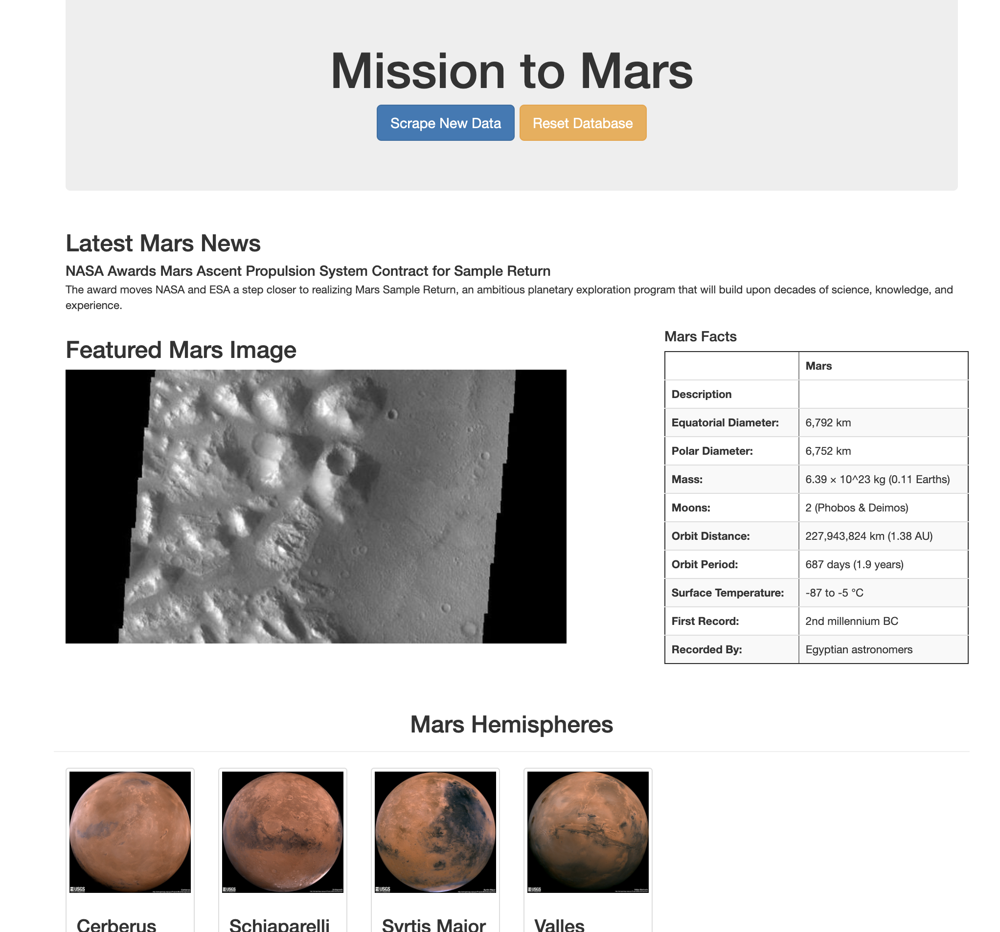

# Mission_to_Mars



## Packages required

Step:1 Activate a virtual environment to install the dependencies.

> conda activate PythonData

Step 2: dependencies required and must be installed

```pip install splinter
pip install webdriver_manager
pip install bs4
pip install pymongo
pip install html5lib
pip install lxml
pip install flask_pymongo

For Anaconda:
conda install -c conda-forge python-chromedriver-binary

Step 3: Chromedriver additionnal step for Mac

> executable_path = {'executable_path': ChromeDriverManager().install()}
> browser = Browser('chrome', **executable_path)
```

Step 4: Activate Mongo

This project use a database named "mars_app". Below are the commands to validate the active DB.
Source: https://docs.mongodb.com/manual/tutorial/install-mongodb-on-os-x/

> mongo

> show dbs

> use mars_app

> db.mars.find()

> db.dropDatabase()

### Run the projet

> conda activate PythonData

> python app.py

This project need a matching version number for Google Chrome (Browser) and the webdriver_manager module.

## README.md

```
Configuration README.md
Source: https://guides.github.com/pdfs/markdown-cheatsheet-online.pdf

Branch with GitHub
Source: https://github.com/AAugustine/thirty-minutes-to-merge

```
